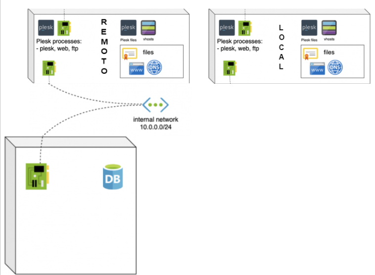
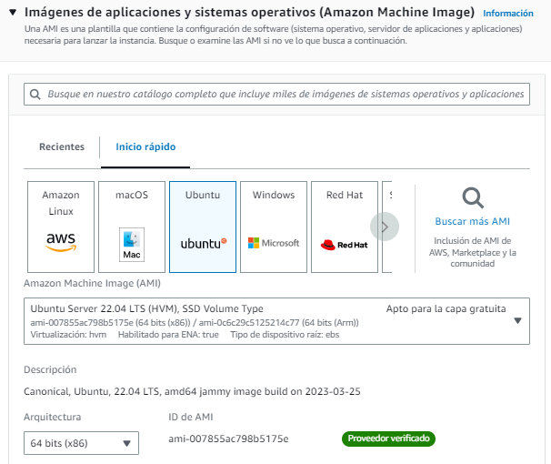
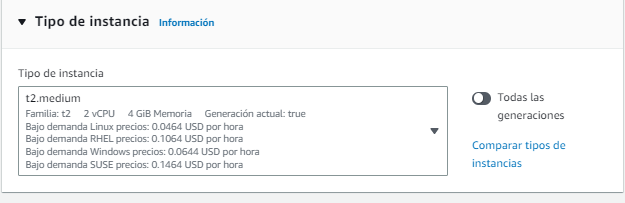
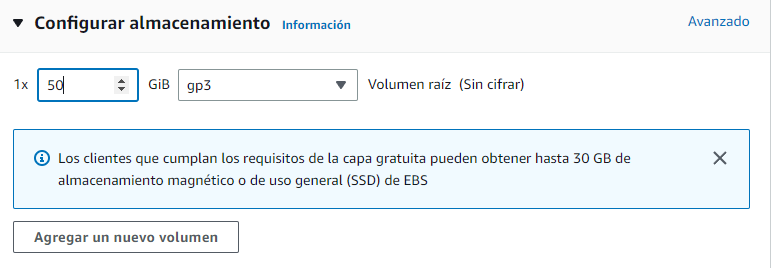

# Hosting con Plesk
En este proyecto voy a llevar a cabo un despliegue en 2 servidores de hosting con Plesk, una instalación local y otra instalación en un servidor con base de datos remota.

## 1. Plesk como herramienta de Hosting
 Plesk es un panel de control de hosting  web. Se utiliza principalmente en entornos de hosting web basados en Windows y Linux. Plesk ofrece una amplia gama de funciones, como la gestión de sitios web, la administración de bases de datos, el correo electrónico y la seguridad, todo en una sola plataforma. Además, Plesk ofrece una amplia variedad de herramientas de automatización y gestión de clientes para ayudar a los proveedores de hosting a administrar sus negocios.

 Este proyecto se centra en utilizar Plesk en un entorno simulado de proveedor de hosting, abordando la creación y mantenimiento de dominios y subdominios, así como explorando todas las herramientas, configuraciones, seguridad, correo, extensiones e importación necesarias para lograr un entorno óptimo y seguro.

 Se exploran diferentes herramientas y configuraciones disponibles para garantizar un ambiente seguro y altamente funcional, tales como la implementación de políticas de seguridad, la aplicación de certificados SSL y la detección y mitigación de posibles vulnerabilidades.

 ## 2. Creación de la infraestructura con AWS:
Para llevar a cabo la instalación y despliegue de Plesk, se utilizará el servicio gratuito de Amazon para crear y configurar los servidores en un entorno real. Amazon ofrece una plataforma sólida y confiable, conocida como Amazon Web Services (AWS), que brinda una infraestructura escalable y flexible.

La infraestructura utilizada será la siguiente:

### Requisitos de las instancia de Plesk en AWS:

Los requisitos de las instancias serán los mismos para los 2 servidores, tanto para el servidor Remoto como para el Local.

- __Sistema Operativo:__ el sistema operativo que se usará será Ubuntu Server 22.04 LTS, pero este no es único Sistema Operativo soportado por Plesk. Plesk es soportado tanto por Windows (Server o no) como por Linux (Ubuntu, Debian, CentOS, RHEL).

    

- __Tamaño de memoria RAM:__ para este proyecto será suficiente con escoger el tipo de memoria “t2.medium” que equivale a 4GB. En caso de tener un servidor de Plesk real si se necesitarán más recursos dependiendo del nivel de carga que se le dará, lo más recomendado para un servidor de Plesk real que se use para administrar un gran número de dominios es mínimo unos 8 o 16 GB de memoria RAM.

    

- __Par de claves:__ el par de claves “vockey.pem” de tipo RSA se usará para que sea posible la conexión remota al servidor usando SSH.

- __Configuración de red:__ en este caso se requiere abrir una serie de puertos específicos para que los servidores funcionen correctamente. Para ello se creará un nuevo grupo de seguridad al que se le asignará a las instancias durante su creación.

    
    
    Los puertos que se necesitarán abrir en las reglas de entrada son los siguientes:

    - __Puertos de Plesk:__ 8443 (__HTTPS__), 8880 (__HTTP__), 8447 (__Actualizaciones__)
    - __Servicios:__ 80 (__HTTP__), 443 (__HTTPS__), 7080 (__Apache Plesk__), 7081 (__SSL Apache Plesk__), 21 (__FTP__), 22 (__SSH__), 3306 (__MariaDB__), 53 TCP y 53 UDP (__DNS__)
    - __Correo:__ 25 y 465 (__SMTP__), 110 y 995 (__POP3__), 143 Y 993 (__IMAP__)
    - Para permitir hacer ping entre las instancias se añade la regla de “Todos los ICMP para iPv4”

- Configuración de almacenamiento: la instalación de Plesk ocupa alrededor  de 10 GB por lo que para tener espacio de sobra ponemos 50 GB de tamaño disco duro.

    