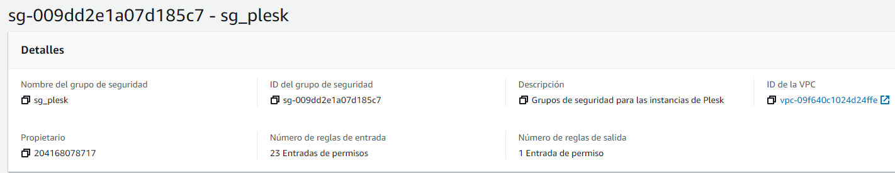
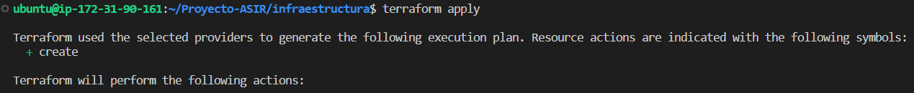

# Hosting con Plesk
En este proyecto voy a llevar a cabo un despliegue en 2 servidores de hosting con Plesk, una instalación local y otra instalación en un servidor con base de datos remota.

## 1. Plesk como herramienta de Hosting
 Plesk es un panel de control de hosting  web. Se utiliza principalmente en entornos de hosting web basados en Windows y Linux. Plesk ofrece una amplia gama de funciones, como la gestión de sitios web, la administración de bases de datos, el correo electrónico y la seguridad, todo en una sola plataforma. Además, Plesk ofrece una amplia variedad de herramientas de automatización y gestión de clientes para ayudar a los proveedores de hosting a administrar sus negocios.

 Este proyecto se centra en utilizar Plesk en un entorno simulado de proveedor de hosting, abordando la creación y mantenimiento de dominios y subdominios, así como explorando todas las herramientas, configuraciones, seguridad, correo, extensiones e importación necesarias para lograr un entorno óptimo y seguro.

 Se exploran diferentes herramientas y configuraciones disponibles para garantizar un ambiente seguro y altamente funcional, tales como la implementación de políticas de seguridad, la aplicación de certificados SSL y la detección y mitigación de posibles vulnerabilidades.

 ## 2. Creación de la infraestructura con AWS:
Para llevar a cabo la instalación y despliegue de Plesk, se utilizará el servicio gratuito de Amazon para crear y configurar los servidores en un entorno real. Amazon ofrece una plataforma sólida y confiable, conocida como Amazon Web Services (AWS), que brinda una infraestructura escalable y flexible.

La infraestructura utilizada será la siguiente:


### Requisitos de las instancia de Plesk en AWS:

Los requisitos de las instancias serán los mismos para los 2 servidores, tanto para el servidor Remoto como para el Local.

- __Sistema Operativo:__ el sistema operativo que se usará será Ubuntu Server 22.04 LTS, pero este no es único Sistema Operativo soportado por Plesk. Plesk es soportado tanto por Windows (Server o no) como por Linux (Ubuntu, Debian, CentOS, RHEL).

    

- __Tamaño de memoria RAM:__ para este proyecto será suficiente con escoger el tipo de memoria “t2.medium” que equivale a 4GB. En caso de tener un servidor de Plesk real si se necesitarán más recursos dependiendo del nivel de carga que se le dará, lo más recomendado para un servidor de Plesk real que se use para administrar un gran número de dominios es mínimo unos 8 o 16 GB de memoria RAM.

    

- __Par de claves:__ el par de claves “vockey.pem” de tipo RSA se usará para que sea posible la conexión remota al servidor usando SSH.

- __Configuración de red:__ en este caso se requiere abrir una serie de puertos específicos para que los servidores funcionen correctamente. Para ello se creará un nuevo grupo de seguridad al que se le asignará a las instancias durante su creación.

    
    
    Los puertos que se necesitarán abrir en las reglas de entrada son los siguientes:

    - __Puertos de Plesk:__ 8443 (__HTTPS__), 8880 (__HTTP__), 8447 (__Actualizaciones__)
    - __Servicios:__ 80 (__HTTP__), 443 (__HTTPS__), 7080 (__Apache Plesk__), 7081 (__SSL Apache Plesk__), 21 (__FTP__), 22 (__SSH__), 3306 (__MariaDB__), 53 TCP y 53 UDP (__DNS__)
    - __Correo:__ 25 y 465 (__SMTP__), 110 y 995 (__POP3__), 143 Y 993 (__IMAP__)
    - Para permitir hacer ping entre las instancias se añade la regla de “Todos los ICMP para iPv4”

- __Configuración de almacenamiento:__ la instalación de Plesk ocupa alrededor  de 10 GB por lo que para tener espacio de sobra ponemos 50 GB de tamaño disco duro.

    

- __Asignación de una IP Elástica:__ asignamos IP’s elásticas a las 3 instancias para que no cambien la IP’s cuando se reinicie AWS y para que no se rompa el servidor de Plesk por cambiar de IP.

## 2.1. Uso de Terraform con AWS

### ¿Qué es Terraform?

Terraform es una herramienta de código abierto que automatiza la creación y gestión de infraestructura en la nube. Permite describir la infraestructura deseada en un archivo de configuración y luego desplegarla de manera consistente y repetible en diferentes proveedores de cloud. Simplifica el proceso de administrar recursos como servidores, redes y bases de datos, facilitando la gestión eficiente de la infraestructura.

### Requisitos para uso de Terraform con AWS

Para el despliegue de infraestructura de servidores en AWS con Terraform es necesario instalar la herramienta de AWS CLI.

AWS CLI (__Command Line Interface__) es una herramienta que se ejecuta desde la línea de comandos que permite gestionar todos los servicios de Amazon Web Services.

Para instalar AWS CLI en nuestra instancia seguiremos los siguientes pasos:

1. Descargamos un archivo .zip con la aplicación AWS CLI.
    ```bash
    curl "https://awscli.amazonaws.com/awscli-exe-linux-x86_64.zip" -o "awscliv2.zip"
    ```
2. Descomprimimos el archivo que acabamos de descargar.
    ```bash
    unzip awscliv2.zip
    ```
3. Ejecutamos el script de instalación.
    ```bash
    sudo ./aws/install
    ```
4. Comprobamos que la instalación se ha realizado de forma correcta.
    ```bash
    aws --version
    ```
    

5. Configuramos AWS CLI con las credenciales de nuestra cuenta de AWS.

    

### Instalación de Terraform

Instalaremos Terraform en una instancia de AWS usando Ubuntu 22.04 como Sistema Operativo.

1. Primero actualizamos los paquetes del sistema e instalamos los recursos necesarios.
    ```bash
    sudo apt update && sudo apt install software-properties-common gnupg2 curl
    ```
2. Cargamos la clave GPG del repositorio
    ```bash
    curl https://apt.releases.hashicorp.com/gpg | gpg --dearmor >  hashicorp.gpg
        
    sudo install -o root -g root -m 644 hashicorp.gpg /etc/apt/trusted.gpg.d/
    ```
3. Instalación de Terraform en Ubuntu
    ```bash
    sudo apt-add-repository "deb [arch=$(dpkg --print-architecture)] https://apt.releases.hashicorp.com $(lsb_release -cs) main"

    sudo apt update && sudo apt install terraform
    ```
4. Comprobamos que se ha instalado correctamente viendo la versión de Terraform.

    

5. Al estar usando Visual Studio Code, como extra vamos a instalar la extensión de Terraform para que Code detecte el lenguaje que usa Terraform, que es YAML y la extensión de los archivos de Terraform “.tf”.

    

### Despliegue de la infraestructura con Terraform

Primero crearemos los grupos de seguridad habilitando los puertos necesarios para cada instancia:


A continuación, creamos las instancias, asignándole la AMI del Sistema Operativo que queremos usar, el tamaño de RAM, el tipo de key, el grupo de seguridad que hemos creado, el nombre de la instancia y el tamaño de disco que usaremos:


Finalmente asignamos una IP elástica a cada una de las instancias:


Para ver el script completo aquí se puede ver: 

https://github.com/Mihai95102/Proyecto-ASIR/blob/main/infraestructura/plesk_infraestructure.tf

Una vez tengamos el script de la infraestructura creado, iniciaremos el script para que se creen las instancias.
Para iniciar el proceso ejecutamos los siguientes comandos:

```bash 
terraform init (iniciamos la herramienta de Terraform)
```


```bash
terraform apply (cargamos el contenido del script que hemos hecho para que se inicie el proceso de creación)
```



Primero nos mostrará los cambios que se van a aplicar y al final tendremos que escribir “yes” para confirmar los cambios.


Al acabar la ejecución del script, podemos ir a nuestras instancias de AWS y veremos que se han creado correctamente todas las instancias.


## 3. Instalación de Plesk